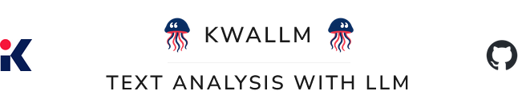
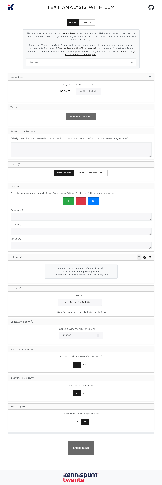
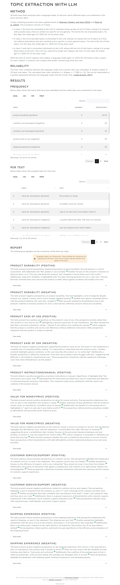
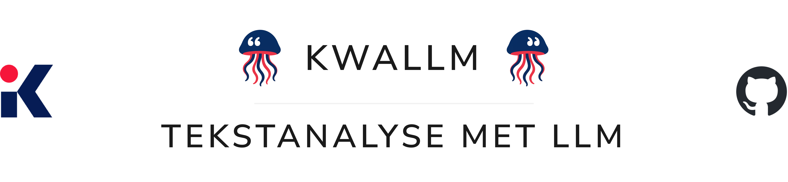
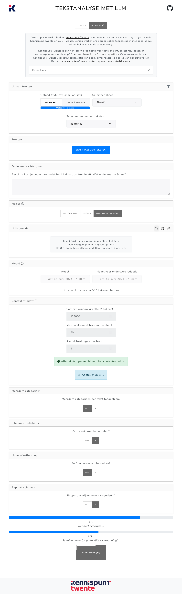
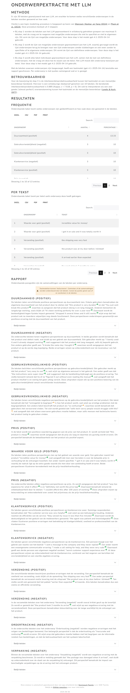

  

---

# KWALLM: text analysis with LLM (app)

KWALLM is an app (developed with R, Shiny) for (automated) qualitative text analysis using large language models (LLMs). Through a user-friendly interface, users can upload texts and have them analyzed by an LLM. The app offers various types of analysis, including categorization, scoring on characteristics, and topic modelling.

*[Klik hier voor een Nederlandse README (click here for a Dutch README).](#kwallm-tekstanalyse-met-llm-app)*

## Features

### Automated text analysis by an LLM

- **Categorization**: Users provide a list of categories, and the model classifies texts accordingly (e.g., 'positive', 'negative', 'neutral')

- **Scoring on a feature**: Users define a feature (e.g., 'positive sentiment'), and the model scores texts based on the degree to which they match the feature

- **Topic modelling**: The model identifies topics in the texts without requiring predefined categories or features. Topics are then assigned to texts. Based on methods from [Wanrooij, Manhar & Yang (2024)](https://bnaic2024.sites.uu.nl/wp-content/uploads/sites/986/2024/10/Topic-Modeling-for-Small-Data-using-Generative-LLMs.pdf) and [Pham et al. (2023)](https://arxiv.org/abs/2311.01449). This approach is shown to outperform BERTopic and works well on small datasets

### User-friendly interface

- **Web interface** suitable for non-technical users. Users can easily upload texts, choose an analysis method, and start the analysis  
  - See [screenshot](example/screenshot_interface_en.png) (or scroll below)

- **Report with results and explanation** of the applied method
  - See [screenshot](example/usecase/report_with_results_screenshot_en.png) (or scroll below)

### Additional analysis features

- Have the LLM write a **summary** representing the texts in each category, including quotes

- **Interrater reliability**: Users can draw a blind sample to compare their own ratings to those of the LLM. Cohen’s Kappa is calculated for reliability

- **Human-in-the-loop**: Users can edit topics identified by the model, e.g., merge or delete topics

- **PII redaction**: Email addresses, phone numbers, and postal codes are automatically redacted before texts are sent to the LLM, to protect respondent privacy

### Configurable

- Connect to **any LLM provider**, including local ones (e.g., [Ollama](https://ollama.com)) or external APIs like Azure OpenAI

- Can be run **locally** or **hosted** as a **web application** (e.g., via containerization). Non-technical users can use it like a web page

- App interface & results can be set to **English or Dutch**

## Use case

This app can be used to analyze open-ended responses in surveys, categorize texts like tweets or news articles, et cetera.

For example, Kennispunt Twente used the app to analyze open survey responses about improvements for sports venues in municipalities in Twente. With the app, researchers are able to analyze large volumes of text quickly and easily.

## Installation

The app can be run in three ways. In all cases, the file `app.R` (or a variant) starts the app. This file configures the app, such as the LLM provider and available models.

### 1. R environment

The application can be run from an R environment.
This requires an installation of [R](https://www.r-project.org/)
(this project was built with R 4.4. 2, but other versions may work),
and optionally an environment such as [RStudio](https://www.rstudio.com/products/rstudio/download/).
[Pandoc](https://pandoc.org/) is required to generate reports (installed with RStudio).
[RTools](https://cran.r-project.org/bin/windows/Rtools/) may be required to build packages that this application needs.
The required R packages are automatically installed via the 'renv' package.

1. `git clone https://github.com/kennispunttwente/tekstanalyse_met_llm.git` (or: download
the zip of the repository and unzip it)

2. Open an R environment in the folder (in RStudio this can be done by opening the .Rproj file)

3. Run 'app.R'

### 2. Desktop app

The application can also be used as a desktop application. This can be useful
for users who are not familiar with R or Docker.

A pre-built desktop application for Windows 10/11 (64-bit, x64/AMD64) is
available under [releases](https://github.com/KennispuntTwente/tekstanalyse_met_llm/releases).
This application contains all necessary dependencies and can be used directly.

1. Download the release (`tekstanalyse-met-llm-win32-x64.7z`)

2. Extract the release to a folder; open the folder; start `tekstanalyse-met-llm.exe`

The pre-built desktop application does not have a specific LLM provider configured, but users can
implement an LLM provider themselves while using it (OpenAI-compatible API or [Ollama](https://ollama.com)).

(This application is built with Node.js & Electron; see 'package.json' for more information.
It would also be possible to build a desktop application yourself with the desired configuration,
or for other operating systems such as MacOS or Linux.)

### 3. Container app

The application can also be used as a container application.
For users familiar with Docker (or Podman), this is a convenient way to run the application, because all dependencies are already included in the container. In addition, a container can easily be run on a server or as a cloud-hosted application.

See 'Dockerfile' for an example configuration. You can also use the pre-built container:

1. `docker pull ghcr.io/kennispunttwente/tekstanalyse_met_llm:latest`

2. `docker run -p 3838:3838 ghcr.io/kennispunttwente/tekstanalyse_met_llm:latest`

3. Open the app in your browser (at `http://localhost:3838`)

The pre-built container does not have a specific LLM provider configured, but users can
implement an LLM provider themselves while using it (OpenAI-compatible API from [Ollama](https://ollama.com)).

Note that if you run Ollama on your own machine (i.e., not in the Docker container of this app),
the endpoint `localhost:11434` will not work correctly (because that is a reference within the container). 
You should use the IP address of your machine, or for example the hostname `host.docker.internal` instead of 'localhost' (so: `http://host.docker.internal:11434`).

You can also modify 'Dockerfile-app.R' yourself and then build the container with
a specific configuration.

## About this app

This app was developed by [Kennispunt Twente](https://www.kennispunttwente.nl) in collaboration with GGD Twente. Together, we work on generative AI applications for the public good.

Suggestions or ideas for the app? 
[Open an issue on GitHub](https://github.com/kennispunttwente/tekstanalyse_met_llm/issues/new).

Kennispunt Twente is a (Dutch) non-profit organization focused on data, insights, and knowledge. Interested in what we can do for your organization, for example in generative AI?
Visit [our website](https://www.kennispunttwente.nl), or [get in touch with our developers](mailto:l.koning@kennispunttwente.nl,t.vandemerwe@kennispunttwente.nl?cc=info@kennispunttwente.nl).

---

### Contact

- Luka Koning – [l.koning@kennispunttwente.nl](mailto:l.koning@kennispunttwente.nl)  
- Tjark van de Merwe – [t.vandemerwe@kennispunttwente.nl](mailto:t.vandemerwe@kennispunttwente.nl)  

---

## Screenshots

### Interface

  

### Report with results (topic modelling)

  

---

  

---

# KWALLM: tekstanalyse met LLM (app)

KWALLM is een app (ontwikkeld met R, Shiny) voor (automatische) kwalitatieve
tekstanalyse met large language models (LLMs). Via een gebruiksvriendelijke
interface kunnen gebruikers teksten uploaden en deze laten analyseren
door een taalmodel. De app biedt verschillende analyse-mogelijkheden,
zoals categorisatie, scoren op kenmerken, en topic modelling.

*[Click here for an English README (klik hier voor een Engelse README).](#kwallm-text-analysis-with-llm-app)*

## Functionaliteiten

### Automatische tekstanalyse door een LLM

-   **Categorisatie**: gebruiker levert een lijst van categorieën
    aan, en het model categoriseert teksten op basis van deze
    categorieën. Bijvoorbeeld, 'positief', 'negatief', 'neutraal'
    
-   **Scoren op kenmerk**: gebruiker levert een kenmerk aan, en het
    model scoort teksten op in hoeverre ze bij dit kenmerk
    passen. Bijvoorbeeld, 'positief sentiment'

-   **Topic modelling**: het model bepaalt zelf de onderwerpen in de
    teksten, zonder dat de gebruiker vooraf categorieën of
    kenmerken hoeft aan te leveren. Daarna worden de onderwerpen
    toegekend aan de teksten. Op basis van procedures beschreven
    in [Wanrooij, Manhar, en Yang
    (2024)](https://bnaic2024.sites.uu.nl/wp-content/uploads/sites/986/2024/10/Topic-Modeling-for-Small-Data-using-Generative-LLMs.pdf)
    en [Pham et al. (2023)](https://arxiv.org/abs/2311.01449).
    Performance van deze procedure zou beter zijn dan BERTopic, waarbij deze procedure ook 
    geschikt is voor kleinere datasets

### Gebruiksvriendelijke interface
            
-   **Web-interface**, geschikt voor niet-technische
    gebruikers. Met een eenvoudige interface kunnen gebruikers
    teksten uploaden, de analyse-methode kiezen, en de analyse starten
    
    - Zie [screenshot](example/screenshot_interface_nl.png) (of scroll naar beneden)
        
-   Gebruikers krijgen een **rapport met de resultaten en uitleg** over
    de toegepaste methode
    
    - Zie [screenshot](example/usecase/report_with_results_screenshot_nl.png) (of scroll naar beneden)
        
### Aanvullende mogelijkheden bij tekstanalyse

-   Het taalmodel kan een **samenvattende tekst** schrijven over
    toegekende categorieën, inclusief quotes

-   **Interrater-reliability**: de gebruiker kan zelf een blinde
    steekproef trekken, om zijn beoordelingen te vergelijken met die van
    het taalmodel. Hiermee wordt de betrouwbaarheid (Cohen's Kappa)
    berekend

-   **Human-in-the-loop**: bij onderwerpextractie kan de gebruiker zelf
    de onderwerpen die het model heeft gevonden, aanpassen. Bijvoorbeeld,
    zelf bepaalde onderwerpen samenvoegen of verwijderen
    
-  **Persoonsgegevens redigeren**: persoonsgegevens zoals e-mailadressen,
    telefoonnummers en postcodes worden automatisch geredigeerd
    voordat deze naar het taalmodel worden gestuurd. Hiermee kan
    de privacy van respondenten extra worden beschermd
        
### Configureerbaar

-   Mogelijkheid om aan te sluiten op **elke LLM-provider**, waaronder
    bijvoorbeeld Ollama (lokaal) of Azure OpenAI API. Hiermee kan worden voldaan aan
    eisen op het gebied van privacy en dataveiligheid

-   Mogelijkheid om **lokaal** te draaien of te hosten als
    **webapplicatie** (bijv. als containerized application). Niet-technische
    gebruikers kunnen dus de optie krijgen om de applicatie te gebruiken als webpagina
    
-   De app-interface en resultaten kunnen worden ingesteld op **Engels of
    Nederlands**
      
## Use-case
        
Deze app kan bijvoorbeeld gebruikt worden om open tekst-antwoorden uit vragenlijstonderzoek
te analyseren, of om teksten zoals tweets of nieuwsartikelen te categoriseren. 

Kennispunt Twente heeft deze app o.a. ingezet om erachter te komen welke verschillende verbeterpunten
mensen zien voor sportlocaties in Twentse gemeente, op basis van een open tekstveld in een enquête.
Met de app kunnen onderzoekers snel en gemakkelijk grote hoeveelheden tekst analyseren.

## Installatie

De applicatie kan op verschillende manieren gebruikt worden. 
Bij alle manieren start het bestand 'app.R' (of een variant) de applicatie.
Dit bestand bevat de configuratie van de applicatie, zoals welke
LLM-provider gebruikt wordt en welke taalmodellen beschikbaar zijn.
Bekijk voor meer informatie over de configuratie het bestand 'app.R' en de documentatie daarin.

Er zijn drie opties om de applicatie te starten:

### 1. R-omgeving

De applicatie kan gerund worden vanuit een R-omgeving.
Hiervoor een installatie van [R](https://www.r-project.org/) nodig 
(dit project is gemaakt met R 4.4.2, maar andere versies kunnen ook werken),
en optioneel een omgeving zoals [RStudio](https://www.rstudio.com/products/rstudio/download/).
[Pandoc](https://pandoc.org/) is nodig voor het genereren van rapporten (wordt geïnstalleerd met RStudio).
Mogelijk is [RTools](https://cran.r-project.org/bin/windows/Rtools/) nodig om packages te bouwen die deze applicatie nodig heeft.
Via het package 'renv' worden de benodigde R-packages automatisch geïnstalleerd.

1. `git clone https://github.com/kennispunttwente/tekstanalyse_met_llm.git` (of: download
de zip van de repository en unzip deze)

2. Open een R-omgeving in de map (in RStudio kan dit door het .Rproj-bestand te openen)

3. Run 'app.R'

### 2. Desktop-applicatie 

De applicatie kan ook gebruikt worden als desktop-applicatie. Dit kan handig zijn
voor gebruikers die niet bekend zijn met R of Docker.

Onder [releases](https://github.com/KennispuntTwente/tekstanalyse_met_llm/releases) is een pre-built desktop-applicatie beschikbaar voor Windows 10/11 (64-bit, x64/AMD64).
Deze applicatie bevat alle benodigde dependencies en kan direct worden gebruikt.

1. Download de release (`tekstanalyse-met-llm-win32-x64.7z`)
   
2. Unzip de release naar een map; open de map; start `tekstanalyse-met-llm.exe`

De pre-built desktop-applicatie heeft geen specifieke LLM-provider geconfigureerd, maar gebruikers kunnen
zelf tijdens het gebruik een LLM-provider configureren (OpenAI-compatible API of [Ollama](https://ollama.com)).

(Deze applicatie is gebouwd met Node.js & Electron; zie 'package.json' voor meer informatie.
Het zou ook mogelijk zijn om zelf een desktop-applicatie te bouwen met de gewenste configuratie,
of voor andere besturingssystemen zoals MacOS of Linux.)

### 3. Container-applicatie

De applicatie kan ook gebruikt worden als container-applicatie. Voor gebruikers bekend
met Docker (of Podman) is dit een handige manier om de applicatie te draaien, omdat alle dependencies
al zijn opgenomen in de container. Daarnaast kan een container gemakkelijk op een server
of als cloud-gehoste applicatie worden gedraaid.

Zie 'Dockerfile' voor een voorbeeld-configuratie. Je kan ook de pre-built container gebruiken: 

1. `docker pull ghcr.io/kennispunttwente/tekstanalyse_met_llm:latest`

2. `docker run -p 3838:3838 ghcr.io/kennispunttwente/tekstanalyse_met_llm:latest`

3. Open de app in je browser (op `http://localhost:3838`)

Bij de pre-built container is geen specifieke LLM-provider geconfigureerd, maar gebruikers kunnen
zelf tijdens het gebruik een LLM-provider configureren (OpenAI-compatible API of [Ollama](https://ollama.com)). 

Let op dat wanneer je Ollama draait op je eigen machine (d.w.z., niet in de docker-container van deze app),
het endpoint `localhost:11434` niet juist is (omdat dat een verwijzing is binnen de container). Je moet dan de IP-adres van je machine gebruiken, 
of bijvoorbeeld hostnaam `host.docker.internal` in plaats van 'localhost' (dus: `http://host.docker.internal:11434`).

Je kan ook zelf 'Dockerfile-app.R' aanpassen en dan de container bouwen met 
een specifieke configuratie.

## Over deze app

Deze app is ontwikkeld door [Kennispunt Twente](https://www.kennispunttwente.nl), voortkomend uit een samenwerkingstraject van de Kennispunt Twente en GGD Twente. Samen werken onze organisaties aan
toepassingen met generatieve AI ten behoeve van de samenleving.

Ideeën of verbeterpunten voor de app?
[Open een issue in de GitHub-repository](https://github.com/kennispunttwente/tekstanalyse_met_llm/issues/new).

Kennispunt Twente is een non-profit organisatie voor data, inzicht en kennis. 
Geïnteresseerd in wat Kennispunt Twente voor jouw organisatie kan doen, bijvoorbeeld op gebied van generatieve AI?
Bezoek [onze website](https://www.kennispunttwente.nl) of [neem contact op met onze ontwikkelaars](mailto:l.koning@kennispunttwente.nl,t.vandemerwe@kennispunttwente.nl?cc=info@kennispunttwente.nl).

---

### Contact

- Luka Koning – [l.koning@kennispunttwente.nl](mailto:l.koning@kennispunttwente.nl)  
- Tjark van de Merwe – [t.vandemerwe@kennispunttwente.nl](mailto:t.vandemerwe@kennispunttwente.nl)  

---

## Screenshots

### Interface

  

### Rapport met resultaten (topic modelling)

  

