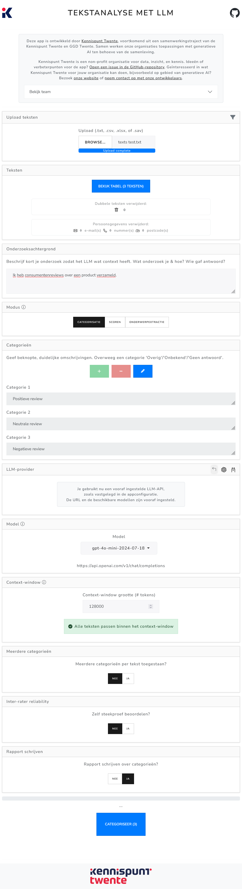
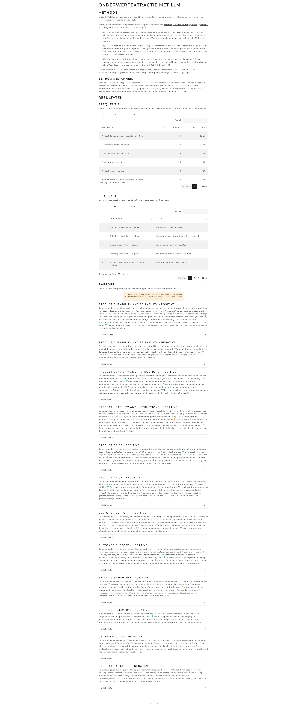

# Text Analysis with LLM (app)
*[Klik hier voor een Nederlandse-README (click here for a Dutch README).](#tekstanalyse-met-llm-app)*

This is an app (R, Shiny) for (automated) qualitative text analysis using large language models (LLMs). Through a user-friendly interface, users can upload texts and have them analyzed by an LLM. The app offers various types of analysis, including categorization, scoring on characteristics, and topic modelling.

## Features

### Automated Text Analysis by an LLM:

- **Categorization**: Users provide a list of categories, and the model classifies texts accordingly (e.g., 'positive', 'negative', 'neutral').

- **Scoring on a Feature**: Users define a feature (e.g., 'positive sentiment'), and the model scores texts based on the degree to which they match the feature.

- **Topic Modelling**: The model identifies topics in the texts without requiring predefined categories or features. Topics are then assigned to texts. Based on methods from [Wanrooij, Manhar & Yang (2024)](https://bnaic2024.sites.uu.nl/wp-content/uploads/sites/986/2024/10/Topic-Modeling-for-Small-Data-using-Generative-LLMs.pdf) and [Pham et al. (2023)](https://arxiv.org/abs/2311.01449). This approach is shown to outperform BERTopic and works well on small datasets.

### User-Friendly Interface

- **Web interface** suitable for non-technical users. Users can easily upload texts, choose an analysis method, and start the analysis.  
  - See 

- **Report with results and explanation** of the applied method.  
  - See 

### Additional Analysis Capabilities

- Generate a **summary** of the assigned categories, including representative quotes.

- **Interrater Reliability**: Users can draw a blind sample to compare their own ratings to those of the LLM. Cohen’s Kappa is calculated for reliability.

- **Human-in-the-loop**: Users can edit topics identified by the model, e.g., merge or delete topics.

- **PII Redaction**: Email addresses, phone numbers, and postal codes are automatically redacted before texts are sent to the LLM, to protect respondent privacy.

### Configurable

- Connect to **any LLM provider**, including local ones (e.g., [Ollama](https://ollama.com)) or external APIs like Azure OpenAI.

- Can be run **locally or hosted** as a **web application** (e.g., via containerization). Non-technical users can use it like a web page.

- App interface & results can be set to **English or Dutch**.

## Use Case

This app can be used to analyze open-ended responses in surveys, categorize texts like tweets or news articles, etc.

Example: Kennispunt Twente used the app to analyze open survey responses about improvements for sports venues in municipalities in Twente. Researchers were able to analyze large volumes of text quickly and easily.

## Installation

The app can be run in three ways. In all cases, the file `app.R` (or a variant) starts the app. This file configures the app, such as the LLM provider and available models.

### 1. R Environment

Requires an [R](https://www.r-project.org/) installation (developed on R 4.4.2, other versions may also work) and optionally [RStudio](https://www.rstudio.com/products/rstudio/download/).  
[Pandoc](https://pandoc.org/) is required to generate reports (included with RStudio).

Steps:

1. `git clone https://github.com/kennispunttwente/tekstanalyse_met_llm.git` (or download & unzip)

2. Open the folder in RStudio (`.Rproj` file)

3. Run `app.R`

### 2. Desktop App

A pre-built desktop app will be available under "Releases" (Windows 10/11, 64-bit).

Steps:

1. Download the release

2. Unzip and run `tekstanalyse-met-llm.exe`

3. Configure your LLM provider (OpenAI-compatible API or [Ollama](https://ollama.com))

(This is built with Node.js & Electron. See `package.json` for details.)

### 3. Container App

You can run the app using Docker. All dependencies are included. Suitable for server or cloud deployment.

- See `Dockerfile` or use the pre-built image (coming soon under Releases).
- Users can configure the LLM provider during use.

To customize, edit `Dockerfile-app.R` and build the container.

## About This App

Developed by [Kennispunt Twente](https://www.kennispunttwente.nl) in collaboration with GGD Twente.  
We work on generative AI applications for the public good.

Suggestions or ideas?  
[Open an issue on GitHub](https://github.com/kennispunttwente/tekstanalyse_met_llm/issues/new)

Contact: [info@kennispunttwente.nl](mailto:info@kennispunttwente.nl)

---

### Team

- Luka Koning – [l.koning@kennispunttwente.nl](mailto:l.koning@kennispunttwente.nl)  
- Tjark van de Merwe – [t.vandemerwe@kennispunttwente.nl](mailto:t.vandemerwe@kennispunttwente.nl)  
- Henk Broekhuizen – [h.broekhuizen@ggdtwente.nl](mailto:h.broekhuizen@ggdtwente.nl)  
- Floor Kerkhof – [f.kerkhof@ggdtwente.nl](mailto:f.kerkhof@ggdtwente.nl)

---

## Screenshots

### Interface

### Report with results (topic modelling)

---

# Tekstanalyse met LLM (app)
*[Click here for an English version of the README (klik hier voor een Engelse versie van de README).](#text-analysis-with-llm-app)*

Dit is een app (ontwikkeld met R, Shiny) voor (automatische) kwalitatieve
tekstanalyse met large language models (LLMs). Via een gebruiksvriendelijke
interface kunnen gebruikers teksten uploaden en deze laten analyseren
door een taalmodel. De app biedt verschillende analyse-mogelijkheden,
zoals categorisatie, scoren op kenmerken, en topic modelling.

## Functionaliteiten

### Automatische tekstanalyse door een LLM:

-   **Categorisatie**: gebruiker levert een lijst van categorieën
    aan, en het model categoriseert teksten op basis van deze
    categorieën. Bijvoorbeeld, 'positief', 'negatief', 'neutraal'
    
-   **Scoren op kenmerk**: gebruiker levert een kenmerk aan, en het
    model scoort teksten op in hoeverre ze bij dit kenmerk
    passen. Bijvoorbeeld, 'positief sentiment'

-   **Topic modelling**: het model bepaalt zelf de onderwerpen in de
    teksten, zonder dat de gebruiker vooraf categorieën of
    kenmerken hoeft aan te leveren. Daarna worden de onderwerpen
    toegekend aan de teksten. Op basis van procedures beschreven
    in [Wanrooij, Manhar, en Yang
    (2024)](https://bnaic2024.sites.uu.nl/wp-content/uploads/sites/986/2024/10/Topic-Modeling-for-Small-Data-using-Generative-LLMs.pdf)
    en [Pham et al. (2023)](https://arxiv.org/abs/2311.01449).
    Performance van deze procedure zou beter zijn dan BERTopic, waarbij deze procedure ook 
    geschikt is voor kleinere datasets

### Gebruiksvriendelijke interface:
            
-   **Web-interface**, geschikt voor niet-technische
    gebruikers. Met een eenvoudige interface kunnen gebruikers
    teksten uploaden, de analyse-methode kiezen, en de analyse starten
    
    - Zie 
        
-   Gebruikers krijgen een **rapport met de resultaten en uitleg** over
    de toegepaste methode
    
    - Zie 
        
### Aanvullende mogelijkheden bij tekstanalyse:

-   Het taalmodel kan een **samenvattende tekst** schrijven over
    toegekende categorieën, inclusief quotes

-   **Interrater-reliability**: de gebruiker kan zelf een blinde
    steekproef trekken, om zijn beoordelingen te vergelijken met die van
    het taalmodel. Hiermee wordt de betrouwbaarheid (Cohen's Kappa)
    berekend

-   **Human-in-the-loop**: bij onderwerpextractie kan de gebruiker zelf
    de onderwerpen die het model heeft gevonden, aanpassen. Bijvoorbeeld,
    zelf bepaalde onderwerpen samenvoegen of verwijderen
    
-  **Persoonsgegevens redigeren**: persoonsgegevens zoals e-mailadressen,
    telefoonnummers en postcodes worden automatisch geredigeerd
    voordat deze naar het taalmodel worden gestuurd. Hiermee kan
    de privacy van respondenten extra worden beschermd
        
### Configureerbaar:

-   Mogelijkheid om aan te sluiten op **elke LLM-provider**, waaronder
    bijvoorbeeld Ollama (lokaal) of Azure OpenAI API. Hiermee kan worden voldaan aan
    eisen op het gebied van privacy en dataveiligheid

-   Mogelijkheid om **lokaal** te draaien of te hosten als
    **webapplicatie** (bijv. als containerized application). Niet-technische
    gebruikers kunnen dus de optie krijgen om de applicatie te gebruiken als webpagina
      
## Use-case
        
Deze app kan bijvoorbeeld gebruikt worden om open tekst-antwoorden uit vragenlijstonderzoek
te analyseren, of om teksten zoals tweets of nieuwsartikelen te categoriseren. 

Kennispunt Twente heeft deze app o.a. ingezet om erachter te komen welke verschillende verbeterpunten
mensen zien voor sportlocaties in Twentse gemeente, op basis van een open tekstveld in een enquête.
Met de app kunnen onderzoekers snel en gemakkelijk grote hoeveelheden tekst analyseren.

## Installatie

De applicatie kan op verschillende manieren gebruikt worden. 
Bij alle manieren start het bestand 'app.R' (of een variant) de applicatie.
Dit bestand bevat de configuratie van de applicatie, zoals welke
LLM-provider gebruikt wordt en welke taalmodellen beschikbaar zijn.
Bekijk voor meer informatie over de configuratie het bestand 'app.R' en de documentatie daarin.

Er zijn drie opties om de applicatie te starten:

### 1. R-omgeving

De applicatie kan gerund worden vanuit een R-omgeving.
Hiervoor een installatie van [R](https://www.r-project.org/) nodig 
(dit project is gemaakt met R 4.4.2, maar andere versies kunnen ook werken),
en optioneel een omgeving zoals [RStudio](https://www.rstudio.com/products/rstudio/download/).
[Pandoc](https://pandoc.org/) is nodig voor het genereren van rapporten (wordt geïnstalleerd met RStudio).
Via het package 'renv' worden de benodigde R-packages automatisch geïnstalleerd.

1. `git clone https://github.com/kennispunttwente/tekstanalyse_met_llm.git` (of: download
de zip van de repository en unzip deze)

2. Open een R-omgeving in de map (in RStudio kan dit door het .Rproj-bestand te openen)

3. Run 'app.R'

### 2. Desktop-applicatie 

De applicatie kan ook gebruikt worden als desktop-applicatie. Dit kan handig zijn
voor gebruikers die niet bekend zijn met R of Docker.

Onder 'releases' komt (binnenkort) een pre-built desktop-applicatie beschikbaar voor Windows 10/11 (64-bit, x64/AMD64).
Deze applicatie bevat alle benodigde dependencies en kan direct worden gebruikt.

1. Download de release
   
2. Unzip het gedownloadde bestand; open de map; start 'tekstanalyse-met-llm.exe'

3. In de interface kan je een LLM-provider configureren (OpenAI-compatible API of [Ollama](https://ollama.com))

(Deze applicatie is gebouwd met Node.js & Electron; zie 'package.json' voor meer informatie.
Het zou ook mogelijk zijn om zelf een desktop-applicatie te bouwen met de gewenste configuratie,
of voor andere besturingssystemen zoals MacOS of Linux.)

### 3. Container-applicatie

De applicatie kan ook gebruikt worden als container-applicatie. Voor gebruikers bekend
met Docker is dit een handige manier om de applicatie te draaien, omdat alle dependencies
al zijn opgenomen in de container. Daarnaast kan een container gemakkelijk op een server
of als cloud-gehoste applicatie worden gedraaid.

Zie 'Dockerfile' voor een voorbeeld-configuratie. Je kan ook de pre-built container gebruiken,
welke (binnenkort) beschikbaar komt onder 'releases'. Bij de pre-built
container is geen specifieke LLM-provider geconfigureerd, maar gebruikers kunnen
zelf tijdens het gebruik een LLM-provider configureren (OpenAI-compatible API of [Ollama](https://ollama.com)). 

Je kan ook zelf 'Dockerfile-app.R' aanpassen en dan de container bouwen met 
een specifieke configuratie.

## Over deze app

Deze app is ontwikkeld door [Kennispunt Twente](https://www.kennispunttwente.nl), voortkomend uit een samenwerkingstraject van de Kennispunt Twente en GGD Twente. Samen werken onze organisaties aan
toepassingen met generatieve AI ten behoeve van de samenleving.

Ideeën of verbeterpunten voor de app?
[Open een issue in de GitHub-repository](https://github.com/kennispunttwente/tekstanalyse_met_llm/issues/new).

Kennispunt Twente is een non-profit organisatie voor data, inzicht en kennis. 
Geïnteresseerd in wat Kennispunt Twente voor jouw organisatie kan doen, bijvoorbeeld op gebied van generatieve AI?
Bezoek [onze website](https://www.kennispunttwente.nl) of [neem contact op met onze ontwikkelaars](mailto:l.koning@kennispunttwente.nl,t.vandemerwe@kennispunttwente.nl?cc=info@kennispunttwente.nl).

---

### Team

- Luka Koning – [l.koning@kennispunttwente.nl](mailto:l.koning@kennispunttwente.nl)  
- Tjark van de Merwe – [t.vandemerwe@kennispunttwente.nl](mailto:t.vandemerwe@kennispunttwente.nl)  
- Henk Broekhuizen – [h.broekhuizen@ggdtwente.nl](mailto:h.broekhuizen@ggdtwente.nl)  
- Floor Kerkhof – [f.kerkhof@ggdtwente.nl](mailto:f.kerkhof@ggdtwente.nl)

---

## Screenshots

### Interface

### Rapport met resultaten (topic modelling)

